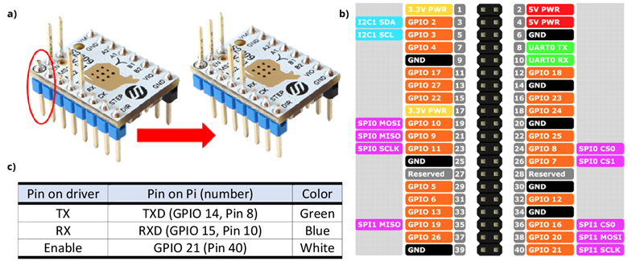
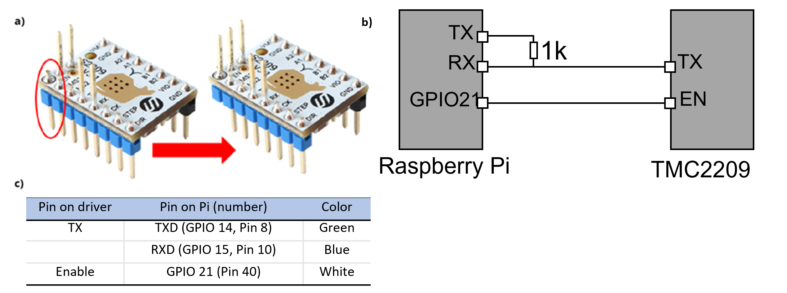

# Current Version 13/06/2023

Please be sure that the installation of octoprint is without klipper

On the raspbery pi installer go to <span style="color:#FF7B15 ">CHOOSE OS </span> **→** <span style="color:#FF7B15 ">Other specific-purpose OS </span> **→** <span style="color:#FF7B15 ">3D printing </span> **→** <span style="color:#FF7B15 ">OctoPi </span> **→** <span style="color:#FF7B15 ">OctoPi (stable) version 1.0.0 </span>

Instructions V1.1 - tested with: RPi_imager_1.7.5, Octoprint image octopi-1.0.0-klipper.20230222112442 and FYSETC Spyder 2.1 with Fysetc TMC2209_V3.1 stepper driver hardware.

#

You will need to copy files to the Raspberry Pi and access its shell/command line - we recommend PuTTY and WinSCP to accomplish this, which you should already be familiar with from the Voron manual.

*   First install and configure the printer as described in the official online Voron manual up to the 'Initial startup - stepper motor check' section. 
    *   While configuring printer.cfg, it is unnecessary to configure the extruder stepper motor. 
*   Invert the Enable pin on your TMC2209 extruder stepper driver board (Instructions Figure a) and remove all jumpers for the corresponding spider motor driver socket.
*   Connect the extruder stepper motor driver pins to the raspberry PI GPIO pins (Instructions Figure b) and c)).



*Figure: Diagram for TMC2209 V3.1 and below Driver modification and gpio wiring*

**If you have a version 4.0 driver refer to the figure below - requires an additional 1k Ohm resistor between RX/TX**
<div style=" width:1000px">



</div>

*   Power up the Printer and access it through Putty
    *   Make sure that both the raspberyr pi and computer and connected to the same wired network and then using PuTTY connect to <span style="color:#FF7B15 ">pi@octopi.local</span> 
    *   You can change the hostname of the raspberry pi in <span style="color:#FF7B15 ">raspi-config </span> **→** <span style="color:#FF7B15 ">1 System Options </span> **→** <span style="color:#FF7B15 ">S4 Hostname </span> **→** Enter your hostname (be sure to remeber this incase you loose the ip address of the raspberry pi)
*   Input the following commands in order:

````sh
pi@octopi:~$ sudo apt update

pi@octopi:~$ sudo apt-get install python3-pip

pi@octopi:~$ pip3 install TMC-2209-Raspberry-Pi

pi@octopi:~$ sudo raspi-config
````
*   Navigate and select **→** <span style="color:#FF7B15 ">3. Interface options </span> **→** <span style="color:#FF7B15 "> 6. Serial port </span> **→** <span style="color:#FF7B15 ">Login shell to be accessible over serial? </span> **→** <span style="color:#FF7B15 ">Select [No] </span> **→** <span style="color:#FF7B15 ">Serial port hardware to be enabled? </span> **→** <span style="color:#FF7B15 ">Select [Yes] </span> **→** <span style="color:#FF7B15 ">Finish </span>
    *   Be sure to restart the raspberry pi after completion of this step
*   Use WinSCP or FileZilla and copy the provided “emotor” folder in this directory on the Pi: <span style="color:#FF7B15 ">/home/pi/scripts</span>
*   Get the ip_address from the raspberry pi, this is what you will use to connect via octoprint using <span style="color:#FF7B15 ">ifconfig</span>
*   Connect to Octoprint via the web interface and navigate to <span style="color:#FF7B15 ">OctoPrint Settings</span> **→** <span style="color:#FF7B15 ">Plugin Manager</span> **→** <span style="color:#FF7B15 ">Get More</span> -> <span style="color:#FF7B15 ">...from URL</span> **→** input the following two links in order:
```
https://github.com/vitormhenrique/OctoPrint-Enclosure/archive/master.zip

https://github.com/kantlivelong/OctoPrint-GCodeSystemCommands/archive/master.zip
```

*   Restart Octoprint using the power menu.
*   Connect to Octoprint via the web interface and navigate to <span style="color:#FF7B15 ">OctoPrint Settings</span> **→** <span style="color:#FF7B15 ">GCODE System Commands</span>
*   Press the plus sign and configure the G-Code: OCTO1 to System:
```
sh /home/pi/scripts/emotor/speed.sh
```
*   Test the command on your motor by running gcodes: OCTO1 5000 to start, OCTO1 0 to stop.

# Finish!

