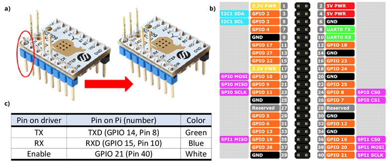

This folder contains the instructions and files necessary to continuously turn a stepper motor through pseudo G-code for MEW printing with Octoprint.
The most recently tested and compatible version of this can be found in the appropriate sub-folder, including  updated files/folders necessary to follow the steps successfully.

-----

Instructions V1.1 - tested with RPi_imager_1.7.5, Octoprint image octopi-1.0.0-klipper.20230222112442 and FYSETC Spyder 2.1 with Fysetc TMC2209_V3.1 stepper driver hardware.

You will need to copy files to the Raspberry Pi and access its shell/command line - we recommend PuTTY and WinSCP to accomplish this, which you should already be familiar with from the Voron manual.

•	First install and configure the printer as described in the official online Voron manual up to the 'Initial startup - stepper motor check' section. While configuring printer.cfg, it is unnecessary to configure the extruder stepper motor. 

•	Invert the Enable pin on your TMC2209 extruder stepper driver board (Instructions Figure a) and remove all jumpers for the corresponding spider motor driver socket.

•	Connect the extruder stepper motor driver pins to the raspberry PI GPIO pins (Instructions Figure b) and c)).

•	Power up the Printer and access it through Putty

•   Input the following commands in order:

sudo apt update

sudo apt-get install python3-pip

pip3 install TMC-2209-Raspberry-Pi

sudo raspi-config

•   Navigate and select -> 3. Interface options  -> P6. Serial port  -> Login shell to be accessible over serial? -> No  -> Serial port hardware to be enabled? -> Yes  -> Finish

•   use WinSCP and copy the provided “emotor” folder in this directory on the Pi: /home/pi/scripts

•   Connect to Octoprint via the web interface and navigate to OctoPrint Settings -> Plugin Manager -> Get More -> ...from URL -> input the following two links in order:

https://github.com/vitormhenrique/OctoPrint-Enclosure/archive/master.zip

https://github.com/kantlivelong/OctoPrint-GCodeSystemCommands/archive/master.zip

•   Restart Octoprint.

•   Connect to Octoprint via the web interface and navigate to OctoPrint Settings -> GCODE System Commands

•	Press the plus sign and configure the G-Code: OCTO1 to System:

sh /home/pi/scripts/emotor/speed.sh

•   Test the command on your motor by running gcodes: OCTO1 5000 to start, OCTO1 0 to stop.

•   Finish!

